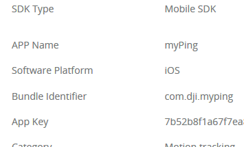

# DJI SDK with Ping device demo for iOS

[English](#what-is-this) | [中文](#这是什么)

## What Is This?

This demo App displays real time flight traffic from the Ping ADS-B receiver connected to the onboard embedded system (OES) running the DJI onboard SDK. 

This mobile App is part of the example of the integration of the Ping ADS-B receiver system with the DJI onboard SDK and mobile SDK. The pingRX ADS-B receiver is connected to the onboard embedded system and it receives real time air traffic information broadcasted by other manned or unmanned aircraft with a range of 100 miles. The onboard App, build upon the DJI onboard SDK, parses the messages from pingRX and transmit them to this mobile App, which then displays the air traffic information on the map.

## Running the SDK Sample Code

This guide shows you how to setup APP Key and run our DJI Mobile SDK  sample project, which you can download it from this **Github Page**.

### Prerequisites

- Xcode 6.4+ or higher
- Deployment target of 6.0 or higher

### Registering a App Key

Firstly, please go to your DJI Account's [User Center](http://developer.dji.com/en/user/mobile-sdk/), select the "Mobile SDK" tab on the left, press the "Create App" button and select "iOS" as your operating system. Then type in the info in the pop up dialog. Once you complete it, you will see the App Key.

Please record the `App Key` and the `Bundle Identifier` (you should have your unique bundle identifier) you just created and we will use them in the following steps.

### Running the Sample Xcode project

1. Download the source code from https://github.com/dji-sdk/onboardsdk-ping-iosapp
2. Open the `Demo/DJISdkDemo.xcodeproj` project in Xcode. 
3. Setup your Apple ID in the Preferences - Account section. 
4. In the general settings, set the currect Bundle Identifier you just created.
5. Modify the **DJIRootViewController.m** file by assigning the App Key string we just created to the **appKey** string object like this:

~~~objc

- (void)viewDidLoad {
    [super viewDidLoad];
    
    // disable the connect button by default
    [self.connectButton setEnabled:NO];
    
    //Register App with key
    NSString* appKey = @"Please enter your App Key here";
    
    if ([appKey isEqualToString:@"Please enter your App Key here"]) {
        ShowResult(@"Please enter App Key.");
    }
    else
    {
        [DJISDKManager registerApp:appKey withDelegate:self];
    }

    self.sdkVersionLabel.text = [@"DJI SDK Version: " stringByAppendingString:[DJISDKManager getSDKVersion]];
    
    self.productFirmwarePackageVersion.hidden = YES;
    self.productModel.hidden = YES;
    
    self.title = @"DJI iOS SDK Sample";
}
~~~

Once you finish it, build and run the project and you can start to try the Ping device demo.

## Support

You can get support from DJI with the following methods:

- [**DJI Forum**](http://forum.dev.dji.com/en)
- Post questions in [**Stackoverflow**](http://stackoverflow.com) using [**dji-sdk**](http://stackoverflow.com/questions/tagged/dji-sdk) tag
- dev@dji.com

---

## 这是什么?

使用DJI SDK 开发的Ping设备demo App, 可以实时获取Ping设备提供的飞机基本飞行数据，并在地图上动态标识出来。你可以为DJI飞行平台量身定做移动APP，发挥出飞行器的最大潜力。关于飞行的一切创意，均可成为现实。

## 运行SDK示例代码

本教程展示了如何配置APP Key, 如何运行DJI Mobile SDK的示例代码，示例代码可以在当前的**Github Page**中下载。

### 开发工具版本要求

- Xcode 6.4+ or higher
- Deployment target of 6.0 or higher

### 开发工具版本要求

- Xcode 6.4 以上
- Xcode Deployment target 6.0 以上

### 注册App Key

首先, 请来到你的DJI 账号的[用户中心](http://developer.dji.com/en/user/mobile-sdk/), 选择左侧的 "Mobile SDK" 选项，然后点击“创建App”按钮，并且选择“iOS”作为开发平台. 接着在弹出的对话框中输入信息.

>注意: 请在`标识码`栏中输入"com.dji.pingdemo", 因为示例代码中的默认bundle identifier就是 "com.dji.pingdemo".

一旦你完成了注册，你将看到App Key.

请记下刚刚创建好的App Key，我们会在接下来的步骤中用到。

### 运行Xcode示例代码

在Xcode中打开 "DJISdkDemo.xcodeproj"工程, 修改 ** DJIRootViewController.m** 文件，将刚创建好的App Key字符串赋值给 **appKey** 对象，如下所示:

~~~objc

- (void)viewDidLoad {
    [super viewDidLoad];
    
    // disable the connect button by default
    [self.connectButton setEnabled:NO];
    
    //Register App with key
    NSString* appKey = @"Please enter your App Key here";
    
    if ([appKey isEqualToString:@"Please enter your App Key here"]) {
        ShowResult(@"Please enter App Key.");
    }
    else
    {
        [DJISDKManager registerApp:appKey withDelegate:self];
    }

    self.sdkVersionLabel.text = [@"DJI SDK Version: " stringByAppendingString:[DJISDKManager getSDKVersion]];
    
    self.productFirmwarePackageVersion.hidden = YES;
    self.productModel.hidden = YES;
    
    self.title = @"DJI iOS SDK Sample";
}
~~~

最后编译运行该工程，你就可以开始流畅地体验实例代码中的功能了。

## 技术支持

你可以从以下方式获得DJI的技术支持：

- [**DJI论坛**](http://forum.dev.dji.com/cn)
- [**Stackoverflow**](http://stackoverflow.com) 
- 请在 [**Stackoverflow**](http://stackoverflow.com)上使用 [**dji-sdk**](http://stackoverflow.com/questions/tagged/dji-sdk) tag提问题
- dev@dji.com

